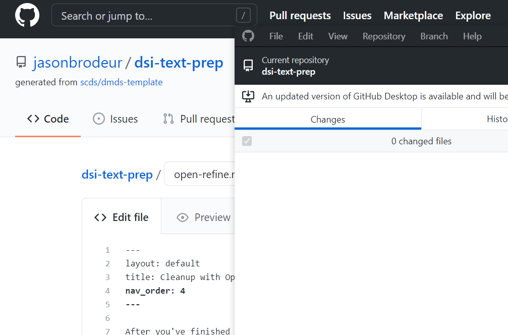

# Prep and Analysis with OpenRefine

## Part I

### Introduction

In the first part of today's workshop, we'll use OpenRefine to prepare text and do some initial or even lightweight analysis.

We’ll be using a transcript from a 1970s radio show, *Soul of Reason*, which is held at NYU’s University Archives. Over the last year, a team at [NYU Libraries](https://library.nyu.edu/) and [NYU's Institute of African American Affairs and Center for Black Visual Culture](https://nyuiaaa.org/) held transcribe-a-thon events to hand-correct autogenerated *Soul of Reason* transcripts and a Wikipedia and Wikidata edit-a-thon. You can find out more about our project on our [website](https://nyu-dss.github.io/soul-of-reason/).

In Fall 2020, the Soul of Reason project team worked with NYU data science graduate student Nyla Ennels, who performed text analysis on a subset of about 53 corrected transcripts. She wrote a Python script to conduct named entity recognition (NER) on the texts and extract the discovered entities into a spreadsheet that could be analyzed further. You can [read more about Nyla's work and find links to her code and Jupyter Notebooks on our website](https://nyu-dss.github.io/soul-of-reason/updates/creating-a-named-entity-recognition-pipeline/).

In the OpenRefine portion of today’s workshop, we’ll use OpenRefine to get a visual sense of some of the kinds of data transformations that happen during text prep and analysis.

### Selecting texts using metadata and facets

You may need to select only a subset of texts for analysis. One way to do this is to use a metadata file to make your selections. For example, maybe you are only interested in texts with authors, or texts published in a certain date range.

On OpenRefine’s main page, switch to the `Open Project tab` (assuming you have already created the project ahead of time...if you haven’t yet, head over to the [Preparation](preparation) to find out how!)

To begin, open the project titled `SoR_metadata`.

``

First, let’s winnow our list down to only transcripts that have been reviewed. Click the down arrow in the column “transcript status” and select `Facet-->Text facet`.

``````

A facet pane will open in the left hand Facet/filter tab. Clicking on `Reviewed` filters the displayed rows down to only those 16 rows with this value in a cell.

``````

Make sure to clear your facet to get back to showing all rows.

``````

We could also narrow down episodes by date. First, let’s convert the date column to the date datatype. In the dropdown menu for the `date` column, let’s select `Edit cells-->Common transforms-->To date`.

SCREENSHOT

Again in the dropdown menu for the `date` column, let’s select `Facet-->Timeline facet`. We can now use the slider to select episodes that aired in a particular year (for example, `1975`).

SCREENSHOT

Having narrowed our results, we can now export a spreadsheet of just this subset of rows using the `Export` dropdown menu on the top right.

SCREENSHOT

Such a metadata file might be used by a script to select the text files that will be analyzed. For example, Nyla’s Soul of Reason Python script links a metadata CSV to the text files in order to process them.

### Manual clean-up using facets

Next, let’s talk about manual clean up (for example, of OCR text). Programs like OpenRefine or even Word can be helpful at this stage for actions like find and replace or harmonizing spelling. We’ll also talk about some common actions involved in analyzing text (such as tokenizing or harmonizing capitalization/case). Alternately, for a small corpus, you might correct the text line by line manually.

We’ll now open our next OpenRefine project, `RG_9_8_184_01.draft.en`. This is a Soul of Reason transcript of Dr. Roscoe Brown’s interview with Ed Lewis and Marcia Gillespie ([listen to the interview here](http://hdl.handle.net/2333.1/79cnpcmp)). These next steps are based on an [in-development module from the Sherman Centre for Digital Scholarship]  (https://scds.github.io/text-analysis-1/) at McMaster University.

#### Tokenizing
Text analysis often involves “tokenizing” your text in some way -- in other words, breaking up the strings into smaller units. Today, we’ll split up sentences into individual words by splitting the contents of each speaker section on the space character.

*Note: if you are not planning to do any editing of tokens in OpenRefine, you can use the Word Facet to take a look at all tokens in a column.*

First, let’s copy our data into a new column. At this stage, I also want to note that anything we do today within OpenRefine will not change the underlying text file, so don’t worry about making a mess!

Under the dropdown menu for `Column 1`:
1. Select `Edit column → Add column based on this column…`
2. Give the new column the name `tokens`
3. Click OK

SCREENSHOT

Now, let’s move each word into its own cell. First, ensure you are in `records` mode.

SCREENSHOT

Next, under the dropdown menu for `tokens`:
1. Select `Edit cells → Split multi-valued cells`
2. Delete the default separator (a comma) and replace it with a space.
3. Click OK

SCREENSHOT

#### Correcting text using facets
Next, let’s take a look at our tokens using a facet. Our auto transcription service made a mistake in transcribing the introduction of the show, so let's take a look at that now.

Scroll down in the facet to find the word *“box.”* with a period. Click once on the word to select the record containing this token.
In Column 1, you’ll see the whole paragraph, which reads:

>*On May 1 1970 a sensational new black magazine focusing on the black woman hit the newsstands of America. Now five years later the fifth anniversary issue of Essence magazine is on the stands and is being received in households throughout the nation. Here at Lewis publisher and Marcia Gillespie editor discuss five exciting years of Essence magazine on tonight soul of reason. This is Soul of reason a program that will examine the roots of the black box.*

The last word in the final sentence should read **thought** instead of **box.** Hovering next to the word **box.** in the facet, click on `edit` and replace the word **box.** with the text **thought.** This is similar to a find and replace action in a text editor or Word. Note that we are only replacing this word in the tokens column, not in the text in Column 1.

Proceed with caution! Back in your facet, you’ll see there is another value for **box** (this time without the period). Clicking on this value, we can see from looking at the original paragraph that the word **box** is correctly transcribed in this instance.

SCREENSHOT

For this text, a more standard find and replace might be easier to use.

As another example, **WNBC** has been split with a space by the auto transcription service. To deal with this, we can make an edit to the **NBC** token and add a **W**. We can also go ahead and delete the standalone **W** token. This kind of correction would be part of your initial data analysis; as Jay pointed out earlier, what kind of clean up and correction of the text you do depends on how tolerant you are of error.

After making these kinds of corrections, your next step might be to reconstitute the text. You can do this by joining multi-valued cells and separating them with a space (basically, the opposite of what you did when you split cells!)

#### Initial analysis using facets and built-in transformations
Let’s move into some lightweight analysis. Looking at the values in the facet, what do you notice?

You may have noticed that OpenRefine treats words with different capitalization or punctuation as different tokens.

*Note: you may have noticed the timestamps; we’ll see how to deal with these in the next section.*

To deal with capitalization, let’s use a common OpenRefine transformation to make all tokens lowercase. In the `tokens` dropdown menu, select `Edit cells → Common transforms → To lowercase`
Notice that the number of options in the facet has decreased from **1275** to **1212**.

SCREENSHOT

We can also get rid of punctuation.

1. Select `Edit cells → Transform`
2. Replace the text `value` with the following expression: `value.chomp(".")` 
3. Click OK

Notice now that the number of options in the facet has decreased from **1212** to **1100**!

*Note: If you are editing/cleaning a text in order to reconstitute it, you would likely want to retain nuance such as capitalization.*


## Part II

### GREL and regular expressions to exclude content
In performing text analysis, there are likely some parts of your text you will want to disregard. In the *Soul of Reason* example, we might want to exclude timestamps from our analysis.

If the bit of data you want to exclude is regularly structured into a discernible pattern, you can use regular expressions to identify it.
In the interest of demonstration, let’s use the undo/redo tab to walk back to the beginning of our `RG_9_8_184_01.draft.en` OpenRefine project. 

*Note: The undo/redo tab saves all of the edits you’ve done. Undoing at this stage means we will lose the work we did; if you want to save your steps for future reference, you can copy them from the “Extract” menu and paste them into a text file.*

Walk all the way back to step 0. Make sure to select `rows` mode.

SCREENSHOT

Now, let’s use a regular expression to find the rows with timestamps in them and move them into their own column. Looking at the data, how would you describe this pattern?

I like to use the website [Regex101](https://regex101.com/) to test my regular expressions. I pasted a couple of the speaker timestamps into the Regex101 editor and fiddled around until I had a regular expression matching my pattern: `\d+ \d{2}:\d{2}:\d{2}.\d{3}`

Under the dropdown menu for `Column 1`, select Text filter:
1. check the `regular expression` option
2. Paste the regular expression into the box.

Much like a facet, this filter has selected only the matching rows. Now, we can use the same `Edit column → Add column based on this column` action we did earlier to create our tokens column; this time, however, we’ll call the column “timestamp”.

Back in our filter, let’s select `invert` to exclude the rows matching the regular expression. Now, we can create a tokens column the same way we did earlier in part one of today’s lesson: 
1. `Edit column → Add column based on this column`
2. Call the new column `tokens`
3. `Edit cells → Split multi-valued cells` using a space.

Regular expressions such as the one we just used are extremely powerful. Nyla’s script, for example, used a regular expression to remove the timestamps before moving on to later steps of entity recognition.


### Stemming and clustering to identify errors and analyze text
For the last part of our OpenRefine session, we’ll explore stemming and clustering as both a way to detect errors in your source text and a form of analysis. For this demonstration, we’ll use some messy OCR data from an article by Bernard Berenson.

Open the OpenRefine project `25515893 txt`:
1. Create a `tokens` column the same way we’ve done before
2. Open a text facet for the `tokens` column.
	*Bonus question: do you see any values here we might find and delete using a regular expression?*
3. In the facet, click `cluster`

SCREENSHOT

OpenRefine’s clustering makes use of different algorithms to find values that might look different to a computer but are understood to be the same to a human. It does this by “tokenizing” the text in a more sophisticated way than we’ve been doing. While we’ve treated each “word” as a token, OpenRefine’s clustering options take various approaches to understanding chunks of strings, for example by taking a “bag” approach and scrambling the letters into alphabetical order, approaching a string phonetically, or using “nearest neighbor” methods.
For more on what’s going on behind the scenes, the [OpenRefine user manual](https://docs.openrefine.org/manual/cellediting#cluster-and-edit) explains the different algorithms.

In this case, we see that some artist names are either separated by a space (*Guer cino*) or are a bit mangled (*correg ncRftJH GIO*). Clustering might help us identify some of these issues and correct them.

Nearest neighbor, levenstein, radius 5, block characters 6 yielded some interesting clusters. For example, it grouped some garbage OCR characters correctly with other instances of the word “Nativity”:

SCREENSHOT

We could use this information to either harmonize the tokens, or to find the spot in the text in Column 1 I would like to correct.

Now that we’ve experienced some principles of text cleanup and analysis visually with OpenRefine, in the final part of today’s workshop, we’ll look at how similar actions can be taken using Python.


<!--
After you've finished the [Preparatory steps](preparation) and reviewed the [Introductory material](introduction), open OpenRefine... 
-->

<!--
## Embedding a screenshot (in the assets/img/ folder)
1. Easy way with built-in markdown code (if image is already the right size): 
``````  

results in:   




2. With html (controlling for size)  

``````  

results in:  


-->

<!--

## Embedding a screenshot


## Embedding a workshop recording (with iframe)

<iframe height="480" width="853" allowfullscreen frameborder=0 src="https://echo360.ca/media/4378b2ec-7d0c-4632-a1e4-5a8076a494da/public?autoplay=false&automute=false"></iframe>

View the original [here](https://echo360.ca/media/4378b2ec-7d0c-4632-a1e4-5a8076a494da/public).


## Workshop slides

<div style="position:relative;padding-top:66.25%;">
<iframe src="//docs.google.com/viewer?url=https://github.com/scds/intro-tableau/raw/main/assets/docs/tableau_20201118.pdf?dl=0&hl=en_US&embedded=true" class="gde-frame" style="position:absolute;top:0;left:0;width:100%;height:100%;border:none;" scrolling="no"></iframe>
</div>
[Download as a PDF](https://github.com/scds/intro-tableau/raw/main/assets/docs/tableau_20201118.pdf)
<br>

## Worksheets
**Coming soon!**


-->
